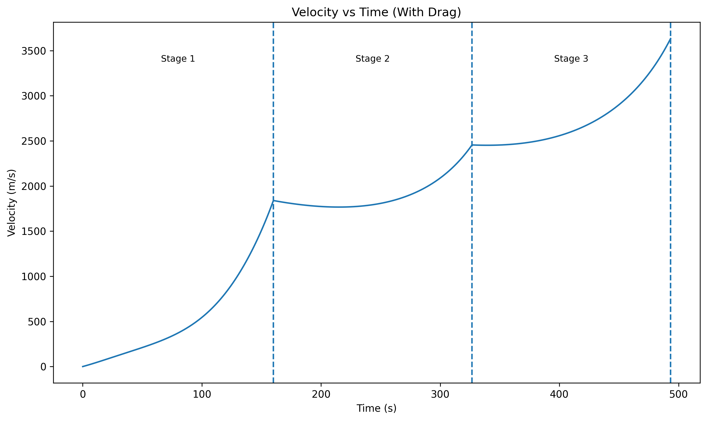
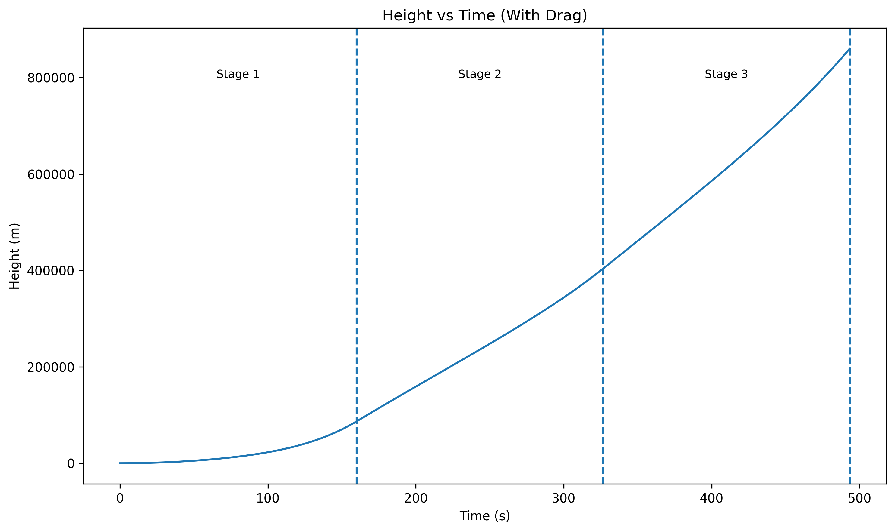

# 🚀 Multi-Stage Rocket Simulation with Drag Analysis

This project is a physics-based simulation that analyzes how multi-stage rockets behave under both ideal and realistic conditions, including atmospheric drag.

---

## 🎯 Project Overview

Rockets are often studied under ideal assumptions, but real-world factors such as air resistance significantly affect their performance.

This project models:
- Multi-stage rocket motion
- Delta-V (change in velocity)
- Atmospheric drag effects
- Time-based flight simulation

---

## ⚙️ Features

- 🚀 Multi-stage rocket modeling  
- 📐 Delta-V calculation using the rocket equation  
- 🌬️ Drag vs no-drag comparison  
- 📊 Velocity and height analysis over time  
- ⚖️ Payload sensitivity analysis  
- 🧠 Orbit feasibility check  
- 🖥️ Interactive Streamlit prototype  

---

## 📊 Key Insights

- Air drag significantly reduces rocket velocity and altitude  
- Payload mass has a strong negative impact on performance  
- Multi-stage rockets improve efficiency by reducing mass  
- Real-world conditions differ significantly from ideal models  

---

## 🖥️ Interactive Prototype

An interactive prototype was built using **Streamlit**.

Users can:
- Adjust payload mass  
- Modify drag coefficient (Cd)  
- Change rocket cross-sectional area  
- Observe real-time changes in performance  

---

## 📈 Example Outputs

### Velocity Comparison (Drag vs No Drag)


### Height Comparison


---

## 🧠 Engineering Perspective

This project demonstrates how physical constraints affect system performance.

Rather than only calculating equations, the simulation:
- Models real-world behavior  
- Allows parameter exploration  
- Supports engineering decision-making  

---

## ⚠️ Model Limitations

- Assumes vertical flight only  
- Uses constant thrust  
- Simplified atmospheric density model  
- Does not include orbital insertion or trajectory control  

Despite these simplifications, the model captures key relationships between mass, drag, and performance.

---

## 🛠️ Technologies Used

- Python  
- Matplotlib  
- Streamlit  

---

## ▶️ How to Run


### Run the simulation:

```bash
python fizik1_notları.py
streamlit run app.py 
